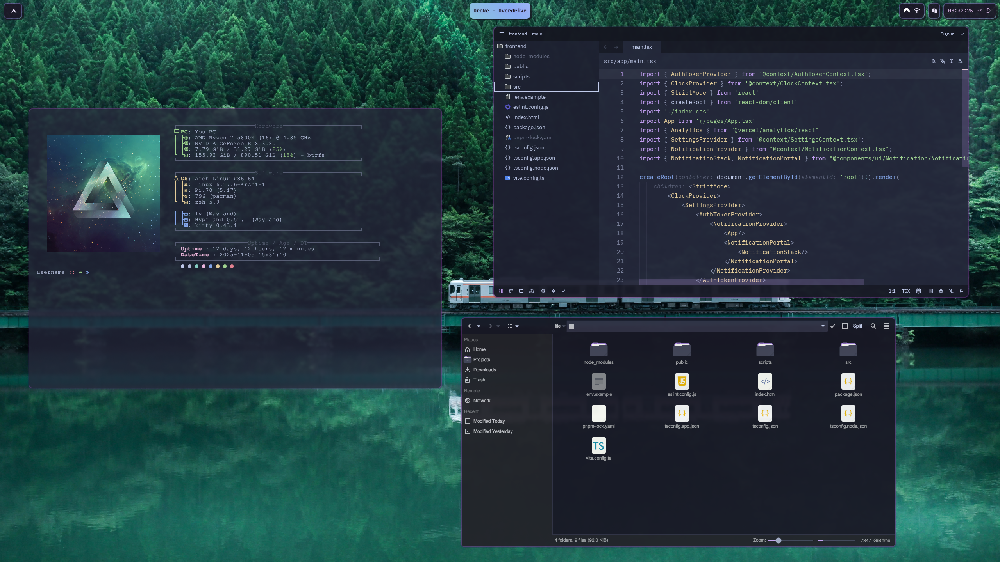

<a id="readme-top"></a>

<br />
<div align="center">
  <a href="https://github.com/boomboompower/dotfiles">
    
  </a>

<h3 align="center">
    Hyprland + Arch · Dotfiles
</h3>

  <p align="center">
    A cozy, keyboard-centric environment built on Arch Linux and Hyprland.  
    Tweaked for speed, simple customization, and a clean visual style.
    <br />
    <a href="./docs"><strong>View configuration details »</strong></a>
    <br />
    <br />
    <a href="#">Preview</a>
    &middot;
    <a href="https://github.com/boomboompower/dotfiles/issues">Report Bug</a>
    &middot;
    <a href="https://github.com/boomboompower/dotfiles/issues">Request Feature</a>
  </p>
</div>


<!-- TABLE OF CONTENTS -->
<details>
  <summary>Table of Contents</summary>
  <ol>
    <li>
      <a href="#about-the-project">About The Project</a>
      <ul>
        <li><a href="#features">Features</a></li>
      </ul>
    </li>
    <li>
      <a href="#getting-started">Getting Started</a>
      <ul>
        <li><a href="#prerequisites">Prerequisites</a></li>
        <li><a href="#installation">Installation</a></li>
      </ul>
    </li>
    <li><a href="#usage">Usage</a></li>
    <li><a href="#roadmap">Roadmap</a></li>
    <li><a href="#contributing">Contributing</a></li>
    <li><a href="#license">License</a></li>
    <li><a href="#contact">Contact</a></li>
  </ol>
</details>


<!-- ABOUT THE PROJECT -->
## About The Project

These are personal configuration files for an Arch Linux desktop powered by **Hyprland**.  
The setup focuses on a lightweight workflow with fast terminal access, smooth animations, and a clean Wayland environment.

The core stack:

| Component          | Package                                                                                           | Install                                                            |
|--------------------|---------------------------------------------------------------------------------------------------|--------------------------------------------------------------------|
| Terminal           | [Kitty](https://github.com/kovidgoyal/kitty)                                                      | `pacman -S kitty`                                                  |
| Shell              | [Zsh](https://wiki.archlinux.org/title/Zsh) + [oh-my-zsh](https://github.com/ohmyzsh/ohmyzsh)     | `pacman -S zsh` and [install ohmyzsh](https://ohmyz.sh/)           |
| WM / Compositor    | [Hyprland](https://github.com/hyprwm/Hyprland)                                                    | `pacman -S hyprland`                                               |
| Status Bar         | [Waybar](https://github.com/Alexays/Waybar)                                                       | `pacman -S waybar`                                                 |
| Editor             | [Zed](https://github.com/zed-industries/zed)                                                      | `pacman -S zed`                                                    |
| File Manager       | [Dolphin](https://github.com/KDE/dolphin)                                                         | `pacman -S dolphin`                                                |
| System Info        | [fastfetch](https://github.com/fastfetch-cli/fastfetch)                                           | `pacman -S fastfetch`                                              |
| Action Menu        | [nwg-bar](https://github.com/nwg-piotr/nwg-bar)                                                   | `pacman -S nwg-bar`                                                |
| Launcher           | [Walker](https://github.com/abenz1267/walker) + [Elephant](https://github.com/abenz1267/Elephant) | `yay -S walker dolphin`<sup>AUR</sup>                              |


<p align="right">(<a href="#readme-top">back to top</a>)</p>


<!-- FEATURES -->
### Features

* Fully modular Hyprland configuration (`hypr/conf/*`)
* GTK + Kvantum theming with Catppuccin influence
* Waybar modules for workspaces, temperature, network, music, notifications, and GPU/CPU usage
* Kitty + Zsh with theme support
* Cava visualizer integrations
* Dolphin + KDE integration details for file handling

<p align="right">(<a href="#readme-top">back to top</a>)</p>


<!-- GETTING STARTED -->
## Getting Started

Clone the repository, then selectively copy only what you want into `~/.config/`. No scripts are included here—manual placement is encouraged so you maintain awareness of changes.


### Prerequisites

* Arch Linux or derivative
* Working Wayland setup
* GPU compatible with Hyprland
* Git


### Installation

Clone the dotfiles and copy the `.config` contents into your home config directory:

```bash
git clone https://github.com/boomboompower/dotfiles
cd dotfiles
cp -r .config/* ~/.config/
```

<!-- USAGE -->
## Usage

Configurations live at:

```bash
~/.config/
```

Highlights:

* `hypr/` holds compositor logic: rules, animations, monitors, and autostart programs. Individual files separate concerns such as appearance, inputs, gestures, layouts, workspace logic, plugins, and window rules.
* `waybar/` provides status bar configuration, including two bar layouts (`bars/`), theme styles, icons, and JSONC modules for CPU, GPU, weather, clipboard, workspaces, and more.
* `kitty/` stores terminal settings and Catppuccin-based themes.
* `zed/` contains editor preferences and themes for consistent syntax highlighting.
* `cava/` includes audio visualizer configurations, themes, and a shader collection for various waveform aesthetics.
* `mako/` configures notification behavior to keep popups minimal.
* `fastfetch/` offers a themed system info layout.
* `dolphin/` + KDE config files store file-manager tweaks and MIME integration.
* `Kvantum/` supports themed Qt styling to help GTK/Qt match visually.
* `elephant/` holds desktop application metadata.

Some extra texture:

Cava’s fragment shaders in `cava/shaders/` let the visualizer speak in different dialects: from classic spectrograms to “eye of phi” wisdom. Spicetify themes roam freely like butterflies of CSS. Waybar feels more like a small instrument toolbox, each JSONC module a quiet gear.

<p align="right">(<a href="#readme-top">back to top</a>)</p>


<!-- ROADMAP -->
## Roadmap

- Migrate away from `nm-applet` when [upstream nmgui PR](https://github.com/s-adi-dev/nmgui/pull/21) is merged
- Rework Waybar themes for deeper aesthetic cohesion
- Create an script which helps automate installation (asks about what themes to apply and does so modularly)

<p align="right">(<a href="#readme-top">back to top</a>)</p>


<!-- CONTRIBUTING -->
## Contributing

This setup reflects personal preferences, but anyone is welcome to explore, adapt, or fork it for experimentation. Contributions, suggestions, or questions are always appreciated.

<p align="right">(<a href="#readme-top">back to top</a>)</p>


<!-- LICENSE -->
## License

No license, feel free to use as you please

Wallpaper: [from here](https://www.reddit.com/r/wallpaper/comments/1iecy75/3840x2160_takayama_japan/) - Takayama, Japan

<p align="right">(<a href="#readme-top">back to top</a>)</p>


<!-- CONTACT -->
## Contact

boomboompower · https://github.com/boomboompower

<p align="right">(<a href="#readme-top">back to top</a>)</p>


